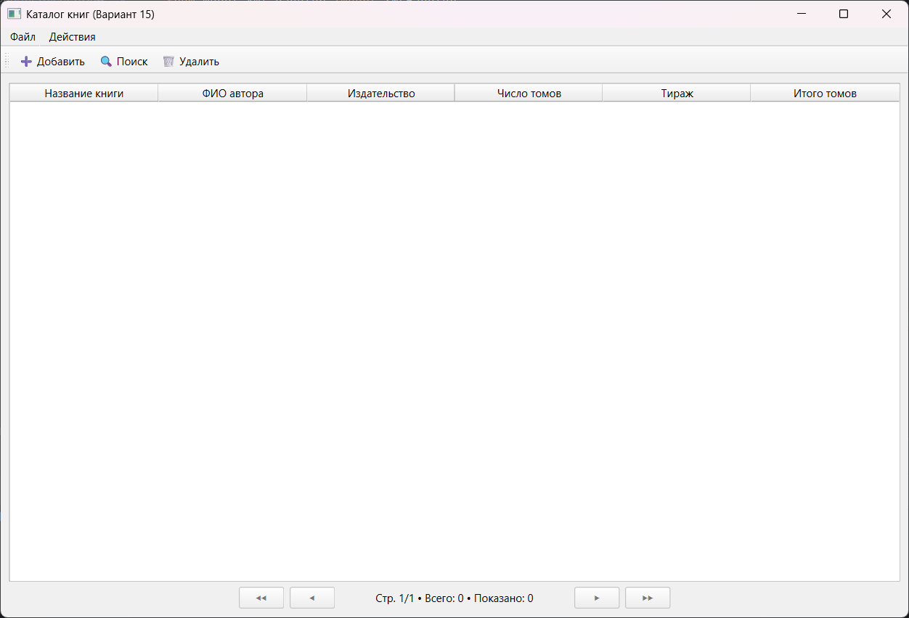
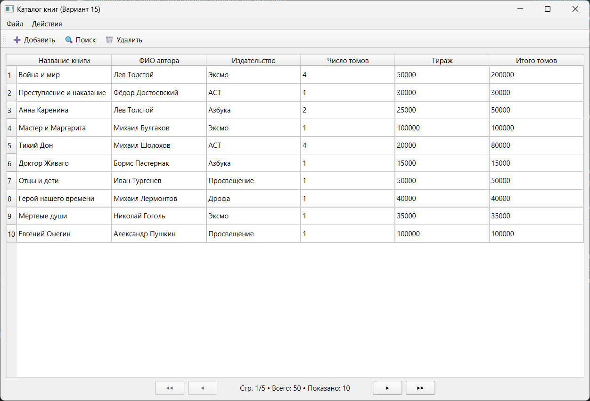
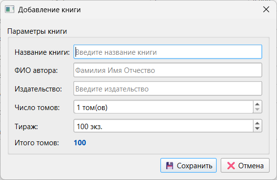
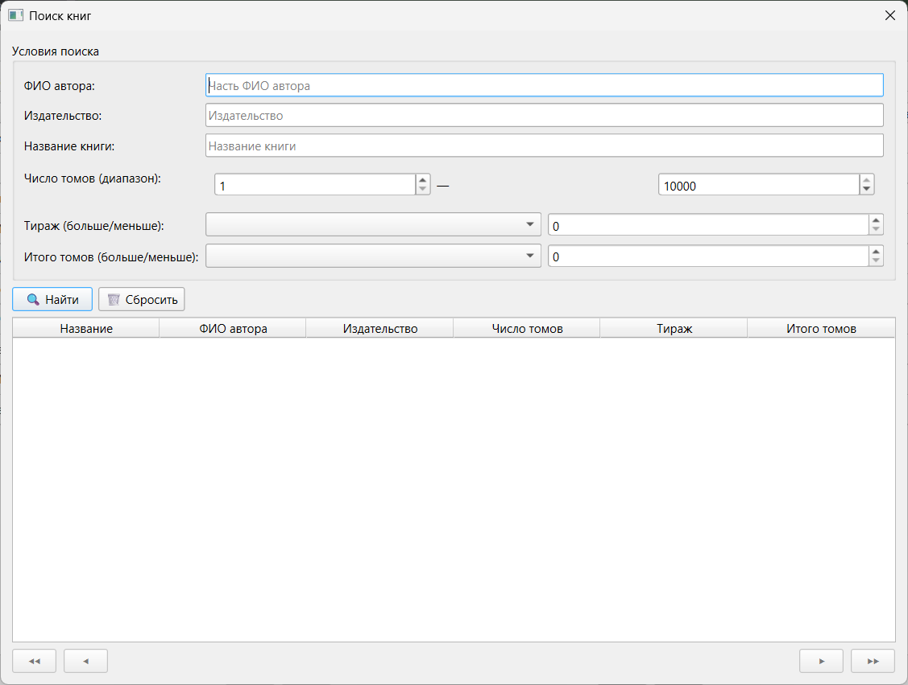
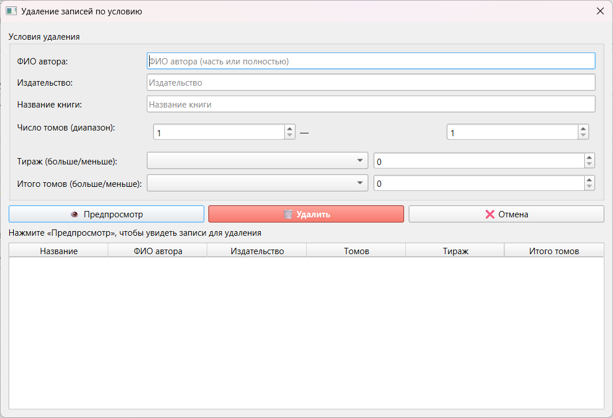

# Catalog — Система управления каталогом книг

> Лабораторная работа №2 по курсу «Проектирование программного обеспечения интеллектуальных систем»  
> **Вариант 15**

---

## О проекте

Catalog — это десктопное приложение с графическим интерфейсом, разработанное в рамках учебной лабораторной работы.
Система предназначена для ведения электронного каталога книг: учёта публикаций, их атрибутов, а также выполнения
операций поиска, фильтрации и удаления записей по гибким условиям.

Приложение реализует полный цикл работы с данными:

- **Ввод и редактирование**: пользователь может добавлять новые книги через удобный диалог с валидацией полей. Все
  числовые поля проверяются на корректность, обязательные поля не могут быть оставлены пустыми.
- **Просмотр**: все записи отображаются в таблице с постраничной навигацией. Это обеспечивает удобную работу даже с
  большими наборами данных, позволяя пользователю контролировать объём отображаемой информации.
- **Поиск и фильтрация**: реализовано шесть различных условий поиска, включая комбинированные запросы и фильтрацию по
  числовым диапазонам. Результаты поиска отображаются в том же диалоговом окне с возможностью пагинации.
- **Удаление**: массовое удаление записей по заданным критериям с подтверждением и информированием пользователя о
  количестве удалённых записей.
- **Сохранение и загрузка**: данные хранятся в формате XML, что обеспечивает переносимость, возможность ручной проверки
  содержимого и совместимость с другими системами.

Проект построен с использованием паттерна Model-View-Controller (MVC), что обеспечивает чёткое разделение
ответственности между компонентами системы, упрощает тестирование, поддержку и возможное расширение функционала.

---

## Требования варианта 15

Согласно заданию лабораторной работы, система должна работать со следующими атрибутами сущности «Книга»:

| Поле           | Тип данных | Описание и ограничения                                                                                                       |
|----------------|------------|------------------------------------------------------------------------------------------------------------------------------|
| Название книги | str        | Текстовое поле, обязательное для заполнения                                                                                  |
| ФИО автора     | str        | Текстовое поле, обязательное для заполнения                                                                                  |
| Издательство   | str        | Текстовое поле, обязательное для заполнения                                                                                  |
| Число томов    | int        | Целочисленное поле, неотрицательное значение                                                                                 |
| Тираж          | int        | Целочисленное поле, неотрицательное значение                                                                                 |
| Итого томов    | int        | Вычисляемое поле: рассчитывается автоматически как произведение «число томов» на «тираж». Не вводится пользователем вручную. |

### Условия поиска и удаления

В соответствии с вариантом задания, система поддерживает следующие критерии фильтрации записей:

1. Поиск по ФИО автора — частичное или полное совпадение.
2. Комбинированный поиск по издательству и ФИО автора — позволяет сузить результаты при работе с большими каталогами.
3. Поиск по диапазону числа томов — пользователь задаёт нижнюю и верхнюю границы.
4. Поиск по названию книги — поддержка частичного совпадения, регистронезависимый поиск.
5. Фильтрация по тиражу — выбор записей, где тираж больше или меньше заданного порогового значения.
6. Фильтрация по вычисляемому полю «итого томов» — аналогично тиражу, с возможностью задания границы.

Важное требование: списки авторов и издательств в диалоговых окнах поиска и удаления формируются динамически на основе
текущих данных в каталоге. Это обеспечивает актуальность подсказок и упрощает ввод условий пользователем.

---

## Архитектура приложения (MVC)

Приложение спроектировано с использованием паттерна Model-View-Controller, что позволяет разделить логику обработки
данных, пользовательский интерфейс и управление потоком выполнения.

### Взаимодействие компонентов

Архитектура приложения реализует поток данных по следующей схеме:

1. Пользователь взаимодействует с элементами интерфейса (View).
2. View генерирует события (нажатие кнопки, изменение поля), которые передаются в Controller.
3. Controller интерпретирует событие, при необходимости запрашивает или изменяет данные в Model.
4. Model выполняет бизнес-логику: валидацию, вычисления, операции с коллекцией данных.
5. Результат возвращается через Controller в View для обновления интерфейса.

Такая организация кода упрощает внесение изменений: например, замена парсера XML или модификация интерфейса не требует
переписывания всей системы.

---

## Установка и запуск

Приложение разработано на языке Python и использует библиотеку PyQt6 для построения графического интерфейса. Для запуска
необходимо выполнить следующие шаги:

```bash
# Клонирование репозитория
git clone https://github.com/Naevishh/Catalog.git
cd Catalog

# Создание виртуального окружения (рекомендуется для изоляции зависимостей)
python -m venv venv

# Активация виртуального окружения
# Для Linux/macOS:
source venv/bin/activate
# Для Windows:
venv\Scripts\activate

# Установка зависимостей
pip install -r requirements.txt

# Запуск приложения
python main.py
```

### Зависимости

Файл `requirements.txt`:

```txt
PyQt6>=6.0.0
```

Для реализации графического интерфейса выбрана библиотека **PyQt6** — современная версия привязок к фреймворку Qt. Она
предоставляет богатый набор компонентов, поддерживает кроссплатформенность и использует механизм сигналов и слотов для
обработки событий, что хорошо сочетается с архитектурой MVC.

---

## Пользовательский интерфейс

### Главное окно

При запуске программы пользователю предоставляется пустое главное окно. Интерфейс содержит меню, панель инструментов с
дублирующими командами, а также область для отображения данных. Таблица записей и элементы пагинации становятся
активными только после загрузки файла с данными или добавления первой записи вручную.



После того как модель данных наполняется, в центральной части окна отображается таблица со следующими столбцами:
название книги, ФИО автора, издательство, число томов, тираж, итого томов. Пользователь может просматривать записи с
помощью постраничной навигации, которая позволяет переходить на первую, последнюю, следующую и предыдущую страницу,
изменять количество записей на странице, а также видеть текущий номер страницы и общее число доступных страниц.



### Диалог добавления записи

Диалог добавления (и редактирования) записи обеспечивает корректный ввод данных с помощью следующих механизмов:



- **Валидация типов**: числовые поля принимают только целые неотрицательные значения, текстовые поля не могут быть
  пустыми.
- **Автоматический расчёт**: поле «итого томов» вычисляется сразу после ввода значений «число томов» и «тираж»,
  результат отображается в режиме реального времени.
- **Интуитивный интерфейс**: поля сгруппированы логически, обязательные поля помечены визуально.

### Условия поиска и удаления (Вариант 15)

Согласно заданию лабораторной работы, система поддерживает следующие критерии фильтрации записей:

1. Поиск по ФИО автора — частичное или полное совпадение.
2. Комбинированный поиск по издательству и ФИО автора.
3. Поиск по диапазону числа томов — пользователь задаёт нижнюю и верхнюю границы.
4. Поиск по названию книги — поддержка частичного совпадения, регистронезависимый поиск.
5. Фильтрация по тиражу — выбор записей, где тираж больше или меньше заданного порогового значения.
6. Фильтрация по вычисляемому полю «итого томов» — выбор записей, где значение больше или меньше заданной границы.

Все списки (авторы, издательства) в диалоговых окнах формируются динамически на основе текущих данных каталога.

### Диалог поиска

Диалоговое окно поиска предоставляет гибкий интерфейс для фильтрации записей.



Особенности реализации:

- Условия поиска вводятся в специализированные поля формы: текстовые поля для строк, числовые поля для диапазонов,
  выпадающие списки для выбора автора или издательства.
- Выпадающие списки авторов и издательств заполняются динамически на основе текущих данных каталога, что исключает
  ошибки ввода и ускоряет работу пользователя.
- Результаты поиска отображаются в таблице внутри того же диалогового окна с поддержкой пагинации.
- Пользователь может комбинировать несколько условий для уточнения запроса.

### Диалог удаления записей

Диалог удаления предназначен для массового исключения записей из каталога по заданным критериям. Интерфейс диалога
аналогичен диалогу поиска: пользователь формирует условие фильтрации, после чего система отображает количество записей,
удовлетворяющих этому условию.



Ключевые особенности:

- **Единый набор условий**: для удаления доступны те же критерии, что и для поиска (по автору, издательству, диапазонам
  числовых полей и т.д.), что обеспечивает согласованность интерфейса.
- **Предварительный просмотр**: перед выполнением удаления система показывает пользователю, сколько записей будет
  удалено.
- **Подтверждение операции**: удаление выполняется только после явного подтверждения пользователем, что предотвращает
  случайную потерю данных.
- **Информирование о результате**: после завершения операции выводится сообщение с количеством успешно удалённых записей
  или уведомление о том, что записи, соответствующие условию, не найдены.
- **Динамические списки**: как и в диалоге поиска, выпадающие списки авторов и издательств формируются на основе
  актуальных данных каталога.

После подтверждения удаления контроллер обновляет модель данных, сохраняет изменения и инициирует обновление главного
окна, чтобы отразить актуальное состояние каталога.

---

## Сценарии демонстрации системы

Ниже приведены пошаговые сценарии, которые могут быть использованы для демонстрации работоспособности системы
преподавателю или в рамках защиты лабораторной работы.

#### Сценарий 1: Загрузка данных и навигация по записям

1. Запустите приложение выполнением команды `python main.py`.
2. В главном меню выберите «Файл» → «Загрузить».
3. После загрузки данные отобразятся в таблице главного окна.
4. Продемонстрируйте работу пагинатора: перейдите на третью страницу, затем на последнюю. Убедитесь, что навигация
   работает корректно и отображаемые данные соответствуют выбранной странице.

#### Сценарий 2: Добавление новой записи в каталог

1. В главном окне нажмите кнопку «Добавить» на панели инструментов или выберите в меню «Запись» → «Добавить».
2. В открывшемся диалоге введите данные новой книги: название «On my own», автор «Darci», издательство
   «АСТ», число томов — 2, тираж — 5000.
3. Обратите внимание, что поле «итого томов» автоматически заполняется значением 10000 (2 × 5000).
4. Нажмите кнопку «Сохранить». Диалог закроется, а новая запись появится в таблице главного окна на последней странице.

#### Сценарий 3: Поиск записей по различным условиям

1. В главном меню выберите «Поиск» → «Открыть» для вызова диалога поиска.
2. **Тест А**: в поле «ФИО автора» введите «Булгаков» и нажмите «Найти». В таблице результатов отобразятся все книги
   указанного автора.
3. **Тест Б**: очистите предыдущие условия, задайте диапазон для поля «тираж»: от 1000 до 5000. Система отфильтрует
   записи, соответствующие заданному интервалу.

#### Сценарий 4: Удаление записей по заданным критериям

1. В главном меню выберите «Удаление» → «Открыть».
2. В диалоге удаления задайте условие: «итого томов» меньше 100.
3. Система проанализирует данные и отобразит сообщение: «Найдено _N_ записи для удаления».
4. Подтвердите операцию. После выполнения система сообщит: «Успешно удалено 3 записи».
5. Вернитесь в главное окно и убедитесь, что указанные записи отсутствуют в таблице.

#### Сценарий 5: Сохранение данных в формате XML

1. Внесите несколько изменений в каталог: добавьте новую запись, отредактируйте существующую.
2. В меню выберите «Файл» → «Сохранить».
3. Откройте сохранённый файл в текстовом редакторе и убедитесь, что он содержит корректную XML-структуру с обновлёнными
   данными.
4. При необходимости загрузите этот файл обратно в приложение для проверки целостности данных.

---

## Формат хранения данных (XML)

Данные каталога сохраняются в файле формата XML, что обеспечивает переносимость, читаемость и возможность интеграции с
другими системами.

### Структура XML-файла

Пример записи в файле каталога:

```xml
<?xml version="1.0" encoding="UTF-8"?>
<catalog>
    <book>
        <title>Мастер и Маргарита</title>
        <author>Булгаков М.А.</author>
        <publisher>АСТ</publisher>
        <volumes>2</volumes>
        <print_run>5000</print_run>
        <total_volumes>10000</total_volumes>
    </book>
</catalog>
```

Каждый элемент `<book>` содержит все атрибуты сущности, включая вычисляемое поле `total_volumes`.

### Выбор парсеров для работы с XML

Согласно требованиям лабораторной работы, для операций с XML-файлами используются два различных парсера:

- **DOM (Document Object Model)** — применяется при записи данных в файл. Этот парсер загружает весь документ в память в
  виде дерева объектов, что позволяет удобно модифицировать структуру перед сохранением.
- **SAX (Simple API for XML)** — используется при чтении данных из файла. Это потоковый парсер, который обрабатывает
  документ последовательно, не загружая его целиком в память. Такой подход экономит ресурсы при работе с большими
  файлами и соответствует требованию эффективности.

---

## Тестирование и валидация

При разработке системы особое внимание уделялось корректности обработки данных и устойчивости интерфейса. Были проведены
следующие проверки:

- **Валидация типов данных**: попытка ввести текст в числовое поле (тираж, число томов) блокируется интерфейсом,
  пользователь получает уведомление о некорректном вводе.
- **Автоматический расчёт**: изменение значения в поле «число томов» или «тираж» немедленно приводит к пересчёту поля
  «итого томов».
- **Обработка ошибок**: при попытке загрузить несуществующий или повреждённый XML-файл приложение выводит понятное
  сообщение об ошибке без аварийного завершения.
- **Пагинация**: корректность отображения записей проверялась при различном количестве элементов на странице и общем
  объёме данных.

Для тестирования использовалcя файл с 50 уникальными записями, содержащими реальные названия книг,
имена авторов и издательства.